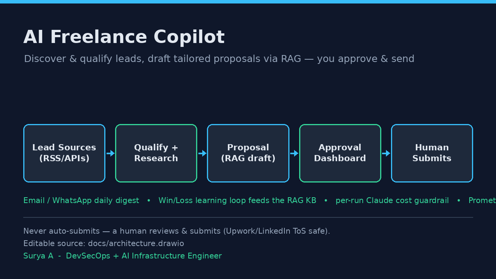

# AI Freelance Copilot

> An agentic copilot that discovers, qualifies, researches, and **drafts** tailored freelance proposals from your portfolio — then hands every draft to **you** to review and submit. It never auto-submits, because that would get your account banned.


## Overview

**AI Freelance Copilot** is a multi-agent system that does the tedious top of the freelancing funnel for you. It fans out to public opportunity feeds, scores each lead against your real skills, researches the prospect, and drafts a specific, non-spammy proposal grounded in your portfolio — quantified wins and all. Every draft lands in a review queue with a fit score and a one-click link, and you get a digest. You decide what to send.

It is built to run **offline by default**: a deterministic hashing embedder and an in-memory vector store mean the full test suite and a dry run need no API key and no network. Plug in your Claude API key and it drafts with Opus; leave it out and the architecture still stands up end to end.

## The Problem It Solves

Freelancers lose hours every day to the same grind: skim dozens of listings, guess which ones fit, research the client, and write a fresh proposal that doesn't read like a template. Most people either burn out or start blasting generic copy — which platforms punish.

This copilot collapses that grind into a single reviewed queue:

- **Discovery** across multiple read-only sources, deduplicated.
- **Qualification** with an explicit 0–100 fit score and the portfolio repos that prove it.
- **Research + drafting** that cite your actual projects and quantified results via RAG.
- **A compliance gate** that rejects anything too short, generic, or spammy before it ever reaches you.
- **A hard cost cap** so a runaway run can't quietly spend your Claude budget.

You spend your time picking winners and pressing send, not trawling job boards.

## How It Works & the Safety Model

This system **never auto-submits anything to any platform.** That is a deliberate, load-bearing design decision — not an oversight.

The pipeline only ever **discovers → qualifies → researches → DRAFTS → queues**. Drafts are written to a local database with status `drafted` and surfaced in an approval dashboard. A **human reviews each one and submits it themselves** on Upwork / LinkedIn / wherever.

Auto-submitting proposals or connection requests **violates the Terms of Service** of Upwork, LinkedIn, and every comparable platform, and is a fast track to an account ban. So:

- The lead sources are **read-only** — they fetch public listings and nothing else.
- The `allow_send` and `dry_run` settings exist only so a human-driven dashboard can mark an item as *already sent by a person*. There is no code path that posts to a freelance platform.
- The closest thing to "submit" is the MCP `mark_submitted` tool, which merely records in the local CRM that you submitted it.

## Architecture



Lead sources feed a fetch-and-dedupe step, then each fresh lead runs through a **LangGraph** agent pipeline — *qualify → research → write → review* — with the proposal writer pulling proof points from a portfolio **RAG** knowledge base and a **cost guardrail** metering every Claude call. Approved drafts are queued in the database, an **email/WhatsApp digest** goes out, and the **approval dashboard** lets a human review and submit. When you mark a lead **won**, the **learning loop** embeds that winning proposal back into the KB. A `/metrics` endpoint exposes everything to Prometheus and Grafana.

> The editable diagram source lives at [`docs/architecture.drawio`](docs/architecture.drawio) — open it with [diagrams.net](https://app.diagrams.net) to modify.

## Agents

| Agent | Model | Role |
|-------|-------|------|
| **Qualifier** | Sonnet (cheap) | Scores lead fit 0–100 and maps it to portfolio repos that prove it. |
| **Researcher** | Sonnet | Summarizes the opportunity into structured enrichment (stack, pain points). |
| **Proposal Writer** | Opus (strong) | Drafts a tailored proposal via RAG, citing real projects and quantified wins. |
| **Compliance / Reviewer** | None (deterministic rules) | Gate: length, anti-spam, must-cite, dedupe — approve or reject before queuing. |
| **Follow-up** | Opus/Sonnet | Drafts a short, polite nudge for a lead gone quiet (human still sends it). |

## Lead Sources

All sources are **read-only** — they fetch public listings and submit nothing.

| Source | What it reads |
|--------|---------------|
| **Remote boards** | RemoteOK, WeWorkRemotely & Remotive feeds — works out of the box, no config. |
| **Contra / startup** | Startup-oriented opportunity feeds (configurable via `COPILOT_STARTUP_FEEDS`). |
| **HN "Who is hiring"** | The monthly Hacker News hiring thread (public Algolia API). |
| **Upwork RSS** *(optional)* | Upwork **discontinued public RSS on 2024-08-20**, so this is off by default. Set `COPILOT_UPWORK_FEEDS` only if you have a third-party RSS bridge; otherwise use Upwork's native saved-search alerts and bid manually. The adapter returns nothing (no error) when unconfigured. |

## Cost Guardrail

Every pipeline run creates a `CostTracker` seeded with `COPILOT_MAX_USD_PER_RUN` (default **$2.00**). The metered LLM wrapper checks the budget **before** each Claude call and records token usage **after**. When cumulative spend reaches the cap, the next call raises `BudgetExhausted`, the run stops cleanly, and the result is flagged `budget_exhausted: true` — no crash, no surprise bill. Pricing is tracked per model (Opus 4.8 at $5 / $25 per MTok).

## Observability

The dashboard exposes a Prometheus `/metrics` endpoint. Key series:

- `copilot_leads_fetched_total`, `copilot_leads_qualified_total`, `copilot_proposals_drafted_total`
- `copilot_proposals_won_total`, `copilot_proposals_lost_total`
- `copilot_claude_cost_usd_total`
- `copilot_fit_score`, `copilot_proposal_quality`, `copilot_rag_retrieval_seconds` (histograms)

A ready-made Grafana board (leads/day, fit-score distribution, win rate, Claude cost) lives at [`monitoring/grafana-dashboard.json`](monitoring/grafana-dashboard.json). In Kubernetes, [`k8s/servicemonitor.yaml`](k8s/servicemonitor.yaml) wires the Prometheus Operator to scrape `/metrics`.

## Learning Loop

When you mark a lead **won** in the dashboard, `record_outcome` flips its status, stamps the proposal, and **embeds the winning proposal back into the RAG knowledge base** as a `kind: "win"` document. Because the Proposal Writer retrieves proof points from that same store, future drafts start citing what has actually closed — the system compounds on its own wins. Marking a lead **lost** records the outcome without touching the KB.

## Inbound Content Engine

Beyond outbound proposals, a small content engine drafts **inbound** marketing from the same portfolio KB — LinkedIn posts, case studies, and gig descriptions — so the pipeline that wins clients also helps attract them:

```bash
python main.py content --kind case-study --topic "Kubernetes cost optimization"
```

## Repository Structure

```text
ai-freelance-copilot/
├── main.py                     # CLI entrypoint (run / dashboard / mcp / build-kb / stats / content)
├── pipeline.py                 # integration core: fetch → graph → queue (never submits)
├── config.py                   # pydantic-settings (safe, offline defaults)
├── costs.py                    # CostTracker + per-run budget guardrail
├── core/
│   ├── schemas.py              # shared Pydantic contracts (Lead, ScoredLead, ...)
│   └── state.py                # LangGraph CopilotState
├── agents/
│   ├── graph.py                # LangGraph orchestrator (qualify→research→write→review)
│   ├── llm.py                  # metered Claude wrapper + offline FakeChat
│   ├── qualifier.py            # fit scoring (Sonnet)
│   ├── researcher.py           # enrichment (Sonnet)
│   ├── proposal_writer.py      # RAG-grounded drafting (Opus)
│   ├── compliance.py           # deterministic review gate
│   └── followup.py             # polite nudge drafts
├── sources/                    # read-only lead adapters + registry
├── rag/                        # embedder, vector store, retriever, ingest, learning loop
├── db/                         # SQLAlchemy models + session
├── observability/metrics.py    # Prometheus metrics (no-op if absent)
├── interfaces/
│   ├── dashboard.py            # FastAPI approval dashboard + /metrics + /healthz
│   ├── notify.py               # email / WhatsApp digest
│   └── mcp_server.py           # FastMCP stdio server for AI clients
├── content/                    # inbound content engine (posts / case studies / gigs)
├── scripts/build_kb.py         # build the portfolio RAG KB
├── monitoring/grafana-dashboard.json
├── k8s/                        # deployment, cronjob, service, configmap, secret, servicemonitor
├── docs/architecture.drawio
├── tests/                      # offline test suite (no API key, no network)
├── Dockerfile · Makefile · requirements.txt · pyproject.toml
└── .github/workflows/ci.yml
```

## Prerequisites

- **Python 3.11+**
- An **Anthropic (Claude) API key** — *optional*: the system runs and tests pass fully offline without one (deterministic embedder + `FakeChat`). A key is only needed for live drafting.
- *(Optional)* SMTP credentials for the email digest, or a WhatsApp Business Cloud API token.
- *(Optional)* Docker + a Kubernetes cluster for deployment.

## Quickstart

```bash
# 1. Clone and enter the repo
git clone https://github.com/suryaanandan1995-dotcom/ai-freelance-copilot.git
cd ai-freelance-copilot

# 2. Create a virtual environment and install
python3.11 -m venv .venv
source .venv/bin/activate
pip install -r requirements.txt

# 3. Build the portfolio knowledge base (offline, no API key)
python -m scripts.build_kb

# 4. Run one pipeline pass (discover → qualify → research → draft → queue)
python main.py run

# 5. Serve the approval dashboard, then open http://localhost:8000
python main.py dashboard
```

To receive digests, copy `.env.example` to `.env` and configure SMTP (`COPILOT_SMTP_HOST`, `COPILOT_SMTP_USER`, …) or the WhatsApp variables, and set `COPILOT_NOTIFY_CHANNEL`. Add `--notify` to `python main.py run` to send one after a run.

## Configuration

All variables are prefixed `COPILOT_` (see [`.env.example`](.env.example)).

| Variable | Default | Description |
|----------|---------|-------------|
| `COPILOT_DATABASE_URL` | `sqlite:///copilot.db` | Storage DSN (use PostgreSQL in prod). |
| `ANTHROPIC_API_KEY` | _empty_ | Claude API key (live runs only). |
| `COPILOT_MODEL_OPUS` | `claude-opus-4-8` | Strong model for drafting. |
| `COPILOT_MODEL_SONNET` | `claude-sonnet-4-6` | Cheap model for scoring/triage. |
| `COPILOT_MAX_USD_PER_RUN` | `2.0` | Hard Claude-spend cap per run. |
| `COPILOT_MIN_FIT_SCORE` | `70` | Leads below this are dropped. |
| `COPILOT_MAX_LEADS_PER_RUN` | `50` | Max leads processed per run. |
| `COPILOT_MAX_PROPOSALS_PER_DAY` | `15` | Anti-spam daily draft cap. |
| `COPILOT_DRY_RUN` / `COPILOT_ALLOW_SEND` | `true` / `false` | Safety flags — auto-send is never enabled. |
| `COPILOT_NOTIFY_CHANNEL` | `email` | `email` · `whatsapp` · `none`. |
| `COPILOT_DASHBOARD_BASE_URL` | `http://localhost:8000` | Base URL used for links in digests. |
| `COPILOT_SMTP_HOST` … `COPILOT_NOTIFY_EMAIL_TO` | _empty_ | SMTP digest configuration. |
| `COPILOT_WHATSAPP_TOKEN` / `_PHONE_ID` / `_TO` | _empty_ | WhatsApp Business Cloud API. |
| `COPILOT_RAG_STORE_PATH` | `data/portfolio_kb.json` | Vector store path. |
| `COPILOT_OWNER_*` | Surya A | Identity used in proposals/signature. |

## Deployment

**Docker**

```bash
docker build -t ghcr.io/suryaanandan1995-dotcom/ai-freelance-copilot:latest .
docker run --rm -p 8000:8000 --env-file .env \
  ghcr.io/suryaanandan1995-dotcom/ai-freelance-copilot:latest
```

The image runs as a non-root user and serves the dashboard by default.

**Kubernetes** ([`k8s/`](k8s/))

```bash
kubectl apply -f k8s/configmap.yaml
cp k8s/secret.example.yaml k8s/secret.yaml   # fill in real values, do not commit
kubectl apply -f k8s/secret.yaml
kubectl apply -f k8s/deployment.yaml -f k8s/service.yaml
kubectl apply -f k8s/cronjob.yaml             # Mon–Fri `python main.py run --notify`
kubectl apply -f k8s/servicemonitor.yaml      # Prometheus scrape of /metrics
```

The **Deployment** serves the always-on approval dashboard; the **CronJob** runs the weekday (Mon–Fri) discovery pass and emails a digest. Both run read-only-rootfs, non-root, with all capabilities dropped.

## CI/CD

GitHub Actions runs on every push and pull request to `main` ([`.github/workflows/ci.yml`](.github/workflows/ci.yml)):

1. Checkout (`actions/checkout@v4`)
2. Set up Python 3.11 (`actions/setup-python@v5`)
3. `pip install -r requirements.txt`
4. `ruff check .`
5. `pytest -q`

The workflow declares `permissions: contents: read` (least privilege). The full test suite is deterministic and runs **offline** — no API key, no network.

## License

Released under the [MIT License](LICENSE).

## Author

**Surya A** — DevSecOps + AI Infrastructure Engineer

- Email: suryaanandan1995@gmail.com
- LinkedIn: https://www.linkedin.com/in/surya-devsecops/
