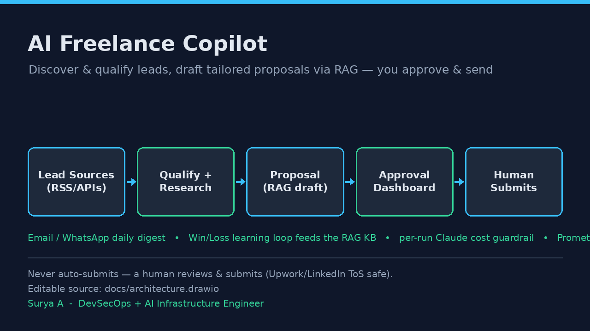
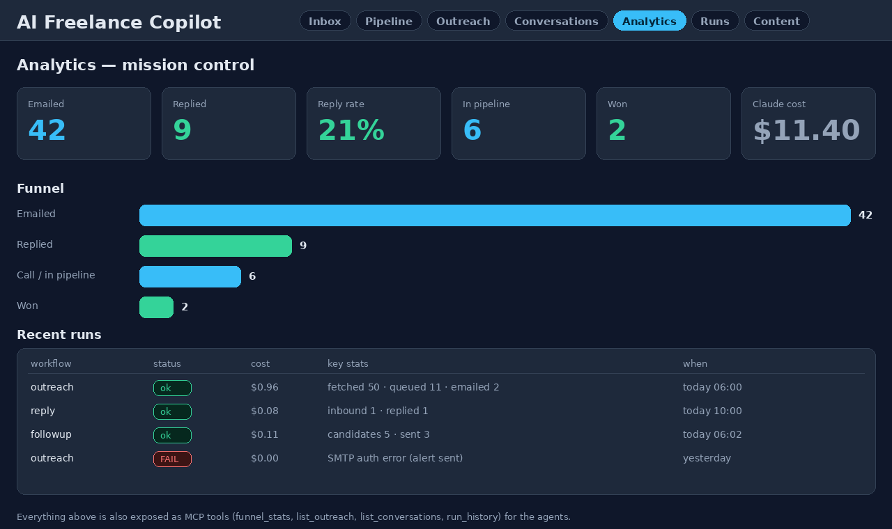

# AI Freelance Copilot

> An agentic copilot that discovers, qualifies, researches, and **drafts** tailored freelance proposals from your portfolio — then hands every draft to **you** to review and submit. It never auto-submits, because that would get your account banned.


## Overview

**AI Freelance Copilot** is a multi-agent system that does the tedious top of the freelancing funnel for you. It fans out to public opportunity feeds, scores each lead against your real skills, researches the prospect, and drafts a specific, non-spammy proposal grounded in your portfolio — quantified wins and all. Every draft lands in a review queue with a fit score and a one-click link, and you get a digest. You decide what to send.

It is built to run **offline by default**: a deterministic hashing embedder and an in-memory vector store mean the full test suite and a dry run need no API key and no network. Plug in your Claude API key and it drafts with Opus; leave it out and the architecture still stands up end to end.

## The Problem It Solves

Freelancers lose hours every day to the same grind: skim dozens of listings, guess which ones fit, research the client, and write a fresh proposal that doesn't read like a template. Most people either burn out or start blasting generic copy — which platforms punish.

This copilot collapses that grind into a single reviewed queue:

- **Discovery** across multiple read-only sources, deduplicated.
- **Qualification** with an explicit 0–100 fit score and the portfolio repos that prove it.
- **Research + drafting** that cite your actual projects and quantified results via RAG.
- **A compliance gate** that rejects anything too short, generic, or spammy before it ever reaches you.
- **A hard cost cap** so a runaway run can't quietly spend your Claude budget.

You spend your time picking winners and pressing send, not trawling job boards.

## How It Works & the Safety Model

This system **never auto-submits anything to any platform.** That is a deliberate, load-bearing design decision — not an oversight.

The pipeline only ever **discovers → qualifies → researches → DRAFTS → queues**. Drafts are written to a local database with status `drafted` and surfaced in an approval dashboard. A **human reviews each one and submits it themselves** on Upwork / LinkedIn / wherever.

Auto-submitting proposals or connection requests **violates the Terms of Service** of Upwork, LinkedIn, and every comparable platform, and is a fast track to an account ban. So:

- The lead sources are **read-only** — they fetch public listings and nothing else.
- The `allow_send` and `dry_run` settings exist only so a human-driven dashboard can mark an item as *already sent by a person*. There is no code path that posts to a freelance platform.
- The closest thing to "submit" is the MCP `mark_submitted` tool, which merely records in the local CRM that you submitted it.

## Architecture



Lead sources feed a fetch-and-dedupe step, then each fresh lead runs through a **LangGraph** agent pipeline — *qualify → research → write → review* — with the proposal writer pulling proof points from a portfolio **RAG** knowledge base and a **cost guardrail** metering every Claude call. Approved drafts are queued in the database, an **email/WhatsApp digest** goes out, and the **approval dashboard** lets a human review and submit. When you mark a lead **won**, the **learning loop** embeds that winning proposal back into the KB. A `/metrics` endpoint exposes everything to Prometheus and Grafana.

> The editable diagram source lives at [`docs/architecture.drawio`](docs/architecture.drawio) — open it with [diagrams.net](https://app.diagrams.net) to modify.

## Agents

| Agent | Model | Role |
|-------|-------|------|
| **Qualifier** | Sonnet (cheap) | Scores lead fit 0–100 and maps it to portfolio repos that prove it. |
| **Researcher** | Sonnet | Summarizes the opportunity into structured enrichment (stack, pain points). |
| **Proposal Writer** | Opus (strong) | Drafts a tailored proposal via RAG, citing real projects and quantified wins. |
| **Compliance / Reviewer** | None (deterministic rules) | Gate: length, anti-spam, must-cite, dedupe — approve or reject before queuing. |
| **Follow-up** | Opus/Sonnet | Drafts a short, polite nudge for a lead gone quiet (human still sends it). |

## Lead Sources

All sources are **read-only** — they fetch public listings and submit nothing.

| Source | What it reads |
|--------|---------------|
| **HN "Who is hiring"** | The two most recent monthly Hacker News hiring threads (public Algolia API). **The main source of leads with a public contact email** — posters routinely publish "email jobs@company.com to apply", which is what makes the [auto-email outreach](#auto-email-outreach) channel possible. Comments are ranked by *contact-hint then AI-infra relevance* **before** the per-run limit truncates them, so the leads that survive are the ones that can actually be emailed. |
| **HN "Freelancer? Seeking freelancer?"** | The companion monthly thread, where the poster is explicitly hiring a contractor. |
| **UK day-rate contract** *(optional)* | Adzuna's official UK jobs API, `contract_only=1` — the segment that actually pays day rates (£525–£550/day DevOps, **£550 median for LLM roles with vacancies up +247% YoY**). Off unless you set `COPILOT_ADZUNA_APP_ID` + `COPILOT_ADZUNA_APP_KEY` (free key: [developer.adzuna.com](https://developer.adzuna.com)); returns nothing, with a log line, when unconfigured. |
| **Remote boards** | RemoteOK, WeWorkRemotely & Remotive feeds — works out of the box, no config. |
| **Jobicy / Working Nomads** | Two further remote-jobs feeds, no config. |
| **Contra / startup** | Startup-oriented opportunity feeds (configurable via `COPILOT_STARTUP_FEEDS`), deduped across feeds since aggregators syndicate each other. |
| **Upwork RSS** *(optional)* | Upwork **discontinued public RSS on 2024-08-20**, so this is off by default. Set `COPILOT_UPWORK_FEEDS` only if you have a third-party RSS bridge; otherwise use Upwork's native saved-search alerts and bid manually. The adapter returns nothing (no error) when unconfigured. |

> Most board listings (Upwork, LinkedIn, remote boards) link back to a platform and expose **no direct email**, so they stay human-submit. The Hacker News threads are the exception — and the only place the auto-email channel sends to.
>
> **`reddit_forhire` was removed, not disabled.** Reddit began returning `403 Blocked` to unauthenticated JSON requests; the adapter contributed nothing but a failing HTTP call on every run for a month. A source that cannot fetch is deleted rather than left in the registry looking operational.

## Auto-Email Outreach

The proposal pipeline is **draft-and-queue for a human** because auto-submitting to Upwork/LinkedIn violates their ToS. But there is **one** channel that is safe to fully automate: **sending a plain email from your own address** to someone who *publicly posted a contact address looking to hire*. That is not a platform ToS violation, and it is the basis of the auto-email outreach subsystem ([`outreach/`](outreach/)).

It is **off by default** and deliberately low-volume. Enable it with `--auto-email` on the `run` command:

```bash
python main.py run --auto-email --notify
```

For each freshly **queued, strong-fit** lead, it:

1. **Extracts a contact email** ([`outreach/extract.py`](outreach/extract.py)) from the lead description / raw fields — rejecting `noreply@`, `@example.`, asset/error domains, etc. In practice this only ever fires on HN "Who is hiring" posts; board listings expose no address and are skipped.
2. **Drafts a short (110–150 word) human cold-intro email** with Opus ([`outreach/pitch.py`](outreach/pitch.py)) — first line specific to their post, one cited portfolio project, at most one quantified win, a soft CTA to the booking link, signed with real identity.
3. **Sends it** over your SMTP ([`outreach/sender.py`](outreach/sender.py)) and records an `OutreachRecord`.

**Every guardrail is on by default:**

- **Master gate** — nothing sends unless `COPILOT_AUTO_EMAIL=true` *and* `COPILOT_SMTP_HOST` is set. The sender is a hard no-op otherwise, so the default config can never email anyone.
- **Fit floor** — only leads scoring ≥ `COPILOT_OUTREACH_MIN_FIT` (default **80**) are contacted.
- **Daily cap** — at most `COPILOT_MAX_EMAILS_PER_DAY` sends per UTC day (code default **20**; the shipped [`.env.example`](.env.example) sets **8**). Low volume protects reply quality, domain reputation, and legality. The cap is counted **across every channel** ([`outreach/quota.py`](outreach/quota.py)) — cold emails and follow-ups draw on one budget, because a sending domain's reputation isn't a property of the code path that used it.
- **Dedupe** — the `outreach` table has a **UNIQUE** email column; an address is **never emailed twice**, across runs.
- **Suppression list** — `data/suppressed.txt` (one lowercased email per line) is honored before every send. Drop an address in there to permanently stop emailing it.
- **Opt-out footer** — every email always carries a plain-text identity + opt-out line (`Reply 'unsubscribe' …`) and a `Reply-To` to `COPILOT_OPT_OUT_MAILBOX`.

**Legality.** This is B2B outreach to people who *published a hiring contact* — a textbook **legitimate-interest** basis under UK **PECR**/GDPR and consistent with CAN-SPAM: a real sender identity, a real reply address, an easy opt-out, no deception, and low volume by design. It is **not** scraped bulk marketing. Upwork/LinkedIn proposals stay human-submit — this channel is **email only** and never touches a platform API.

> Stats from a run include `emailed` and an `emailed_skipped` breakdown (`no_email`, `low_fit`, `duplicate`, `suppressed`, `daily_cap`) so you can see exactly why each lead was or wasn't contacted.

### Deploying the schedule

Outreach runs unattended, so the **dedupe/cap state must persist between runs** — otherwise the `outreach` table resets and you could re-email people. Two supported ways:

1. **System cron on an always-on box** with a **persistent SQLite file** (or the Kubernetes CronJob). The DB lives on disk and survives across runs, so dedupe works out of the box. Add `--auto-email` to the scheduled command and set the env vars.
2. **GitHub Actions** ([`.github/workflows/outreach.yml`](.github/workflows/outreach.yml)) — runners are **ephemeral**, so you **must** point `COPILOT_DATABASE_URL` at a **persistent hosted Postgres**. Without it the dedupe table is thrown away every run. The workflow runs weekdays 06:00 UTC (plus manual dispatch), with a `concurrency` group so runs never overlap, and reads `COPILOT_ANTHROPIC_API_KEY`, `COPILOT_SMTP_*`, `COPILOT_AUTO_EMAIL`, and `COPILOT_DATABASE_URL` from repo secrets.

## Auto-Reply

When a prospect replies to one of those cold emails, the auto-reply subsystem ([`reply/`](reply/)) reads the reply over **IMAP** and responds **autonomously in your voice** — so a conversation keeps moving even while you sleep. It **fully auto-negotiates** the back-and-forth (answering technical and logistical questions helpfully) with one hard exception, and it only ever talks to people you actually emailed (a sender matching an `OutreachRecord` or an existing `ReplyRecord`).

**Hard guardrails** — this is where the safety lives:

- **Never commits pricing, scope, timeline, or contracts.** If the prospect asks about rate, cost, budget, scope, or a deadline, the bot says it depends on specifics and **proposes a short [cal.com](https://cal.com/) call** with your booking link. It cannot quote a firm number, agree to a fixed scope, or accept an NDA / contract on its own — those decisions stay with you, on the call. (Set `COPILOT_STANDARD_RATE` if you want it to mention a rough ballpark; blank = always defer.)
- **You're BCC'd on every reply.** Every autonomous message copies your inbox (`COPILOT_OPT_OUT_MAILBOX` or your owner email), so you see exactly what went out the moment it's sent.
- **Capped per thread.** After `COPILOT_MAX_REPLIES_PER_THREAD` (default **6**) autonomous replies to one prospect, the bot stops replying to that thread — a hard stop against reply loops.
- **Unsubscribe handling.** A not-interested / "unsubscribe" / "remove" / "stop" / hostile reply is acknowledged in one polite line and the address is appended to the suppression list (`data/suppressed.txt`) so nothing further is sent.
- **Truthful.** It never invents experience beyond your portfolio.

**Detection and response are gated separately.** Reading the inbox is what marks a lead `replied`, which is what stops the follow-up sequence and what the optimizer measures as reply rate — so it must not depend on whether you auto-answer. `COPILOT_REPLY_DETECTION` is **on by default** and sends nothing: it records the inbound, marks the lead replied, and honours opt-outs. `COPILOT_AUTO_REPLY` (**off** by default) is what adds the autonomous answering described above. Sharing one gate meant that with auto-reply off nobody was ever marked replied, so prospects who answered kept receiving follow-up nudges while reply rate read `0.0` forever.

Enable full autonomy by setting `COPILOT_AUTO_REPLY=true` plus your SMTP/IMAP creds (IMAP reuses `COPILOT_SMTP_USER` + `COPILOT_SMTP_PASSWORD`; a Gmail app password works for both), then run a pass manually with `python main.py reply` or on the schedule in [`.github/workflows/reply.yml`](.github/workflows/reply.yml) (every 2h, 08:00–18:00 UTC on weekdays). Claude is only invoked when a real unread reply exists, so an empty inbox pass costs nothing — frequent polling is cheap. Like outreach, the per-thread cap and conversation log live in the DB, so on ephemeral runners point `COPILOT_DATABASE_URL` at persistent Postgres.

> **Still watch your inbox.** This runs *with* you, not instead of you. You're BCC'd on every reply and can jump into any thread at any time — reply directly yourself, and the human touch takes over. The bot deliberately hands off anything about money, scope, or commitment to a call with **you**.

## Dashboard (Mission Control)

Everything the system does is visible in one place — and mirrored as MCP tools so the agents can read the same state (for future self-improvement).



| Page | Shows |
|------|-------|
| **Inbox** | Ranked leads with editable proposal drafts + one-click actions |
| **Pipeline** | Leads grouped by status (drafted → approved → submitted → won/lost) |
| **Outreach** | Every cold email sent — status, replied?, follow-ups |
| **Conversations** | Full reply threads (inbound + the agent's auto-replies) |
| **Analytics** | Funnel (emailed → replied → won), reply rate, Claude cost, emails today |
| **Runs** | Every workflow run — ok/fail, cost, key stats (failures alert you by email) |

Run it: `python main.py dashboard` → `http://localhost:8000`. The same data is exposed to agents via MCP tools: `funnel_stats`, `list_outreach`, `list_conversations`, `run_history`.

**Dashboard authentication.** The UI and every write action are protected by **HTTP Basic auth** (constant-time credential check). Set `COPILOT_DASHBOARD_USER` (default `admin`) and `COPILOT_DASHBOARD_PASSWORD` **before exposing the dashboard on any public URL**. A **blank** `COPILOT_DASHBOARD_PASSWORD` disables auth (convenient for local / SSH-tunnel dev). `/healthz`, `/metrics`, and the HMAC-verified `POST /webhooks/cal` stay open so health checks, Prometheus scrapers, and cal.com keep working. See [`DEPLOY.md`](DEPLOY.md) for a free personal HTTPS deploy on Render.

**Call tracking.** To complete the funnel (emailed → replied → **call booked** → won), add a [cal.com](https://cal.com) webhook for the `BOOKING_CREATED` event pointing at `https://<your-dashboard-host>/webhooks/cal`, and set the shared secret in `COPILOT_CAL_WEBHOOK_SECRET` (the endpoint verifies the `X-Cal-Signature-256` HMAC; leave the secret blank to skip verification in dev). When someone you've emailed books a call, that outreach row is stamped `call_booked_at` and the "Call booked" bar lights up in Analytics. The dashboard must be **publicly reachable** for the webhook to fire — a `localhost` instance won't receive it.

## Cost Guardrail

Every pipeline run creates a `CostTracker` seeded with `COPILOT_MAX_USD_PER_RUN` (default **$2.00**). The metered LLM wrapper checks the budget **before** each Claude call and records token usage **after**. When cumulative spend reaches the cap, the next call raises `BudgetExhausted`, the run stops cleanly, and the result is flagged `budget_exhausted: true` — no crash, no surprise bill. Pricing is tracked per model (Opus 4.8 at $5 / $25 per MTok).

## Outcome Reporting

Uptime is not a result. The first production month of this pipeline exited **green on
every scheduled run** while producing 1 email, 0 replies, 0 calls and 0 projects, for
$8.55 — because every reported number was an *activity* count (fetched / new / dropped)
and all of them looked healthy. Activity metrics cannot fail the way this system failed.

So [`monitor/kpi.py`](monitor/kpi.py) reports the funnel in outcome terms over a rolling
window, and names the bottleneck stage:

```bash
python main.py kpi --days 30
```

```text
OUTCOMES — last 30 days
  contactable     41
  emailed         18
  replied         2   (11.1%)
  calls booked    1   (50.0%)
  won             0   (n/a)
  spend           $6.41
  per reply       $3.21

1 call(s) booked, none won yet. The machine is working; the remaining variable is the call itself.
```

Three deliberate choices in there:

- **The verdict is ordered top-down.** An empty top-of-funnel outranks an empty
  downstream stage, because tuning a pitch nobody received cannot change the outcome —
  which is exactly what a month of prompt-tuning against zero contactable leads
  achieved.
- **A rate with no denominator reports `(n/a)`, not `0.0%`.** "0% reply rate" invites
  rewriting a pitch; "n/a" correctly says nobody was emailed.
- **The digest subject carries the outcome.** `[Copilot] NO CONTACTABLE LEADS — sourcing
  needs attention` cannot be mistaken for a normal run in an inbox; `12 drafts queued`
  was, seventeen times.

### Per-source attribution

`sources: 0/46 cleared 70` correctly identifies *targeting* as the bottleneck, and is
still not actionable: with seven sources enabled it does not say which ones produced the
46. "All seven are mediocre" and "six are useless, one is good" give identical totals and
need opposite fixes — re-target everything, or drop six and widen the seventh.

So every run attributes the funnel per source and states a verdict, worst first:

```text
BY SOURCE (worst first — retire what never produces)
  uk_contract      fetched=0    new=0    contactable=0    queued=0   dead: fetched nothing
  remote_boards    fetched=25   new=25   contactable=0    queued=0   unreachable: leads have no email, so scoring them is wasted spend
  hn_hiring        fetched=12   new=12   contactable=7    queued=0   off-ICP: best score 68 < 70
```

The five verdicts are deliberately distinct failures, not severity grades:

| verdict | meaning | fix |
| --- | --- | --- |
| `dead` | fetched nothing at all | credentials, or the endpoint is gone |
| `stale` | fetched only leads already in the DB | widen the query, or retire it |
| `unreachable` | real new leads, none with an email | stop paying to score it |
| `unscored` | pre-gated before reaching the model | check the pre-gates |
| `off-ICP` | scored, none cleared the bar | re-target, or lower the bar |

Two properties matter more than the table itself:

- **A row is seeded for every *enabled* source before fetching**, so a source that yields
  nothing still appears. Building the table from returned leads would omit it entirely,
  and an absent row reads as "not a problem" — which is the failure this report exists to
  expose. `uk_contract` sat `DISABLED` through a month of green runs.
- **Dead sources sort above working ones, and reach the subject line.** A run that queues
  three drafts *and* has a broken source used to read as unqualified success.

Each run also reports its **fit-score distribution** rather than a bare `dropped: 34`,
since that number has two causes needing opposite fixes: scores clustered just below the
threshold mean the threshold is too strict, scores far below it mean the sources are
off-ICP.

## Observability

The dashboard exposes a Prometheus `/metrics` endpoint. Key series:

- `copilot_leads_fetched_total`, `copilot_leads_qualified_total`, `copilot_proposals_drafted_total`
- `copilot_proposals_won_total`, `copilot_proposals_lost_total`
- `copilot_claude_cost_usd_total`
- `copilot_fit_score`, `copilot_proposal_quality`, `copilot_rag_retrieval_seconds` (histograms)

A ready-made Grafana board (leads/day, fit-score distribution, win rate, Claude cost) lives at [`monitoring/grafana-dashboard.json`](monitoring/grafana-dashboard.json). In Kubernetes, [`k8s/servicemonitor.yaml`](k8s/servicemonitor.yaml) wires the Prometheus Operator to scrape `/metrics`.

## Learning Loop

When you mark a lead **won** in the dashboard, `record_outcome` flips its status, stamps the proposal, and **embeds the winning proposal back into the RAG knowledge base** as a `kind: "win"` document. Because the Proposal Writer retrieves proof points from that same store, future drafts start citing what has actually closed — the system compounds on its own wins. Marking a lead **lost** records the outcome without touching the KB.

## Inbound Content Engine

Beyond outbound proposals, a small content engine drafts **inbound** marketing from the same portfolio KB — LinkedIn posts, case studies, and gig descriptions — so the pipeline that wins clients also helps attract them:

```bash
python main.py content --kind case-study --topic "Kubernetes cost optimization"
```

## Repository Structure

```text
ai-freelance-copilot/
├── main.py                     # CLI entrypoint (run / dashboard / mcp / build-kb / stats / content)
├── pipeline.py                 # integration core: fetch → graph → queue (never submits)
├── config.py                   # pydantic-settings (safe, offline defaults)
├── costs.py                    # CostTracker + per-run budget guardrail
├── core/
│   ├── schemas.py              # shared Pydantic contracts (Lead, ScoredLead, ...)
│   └── state.py                # LangGraph CopilotState
├── agents/
│   ├── graph.py                # LangGraph orchestrator (qualify→research→write→review)
│   ├── llm.py                  # metered Claude wrapper + offline FakeChat
│   ├── qualifier.py            # fit scoring (Sonnet)
│   ├── researcher.py           # enrichment (Sonnet)
│   ├── proposal_writer.py      # RAG-grounded drafting (Opus)
│   ├── compliance.py           # deterministic review gate
│   └── followup.py             # polite nudge drafts
├── sources/                    # read-only lead adapters + registry
├── outreach/                   # auto-email channel: extract → pitch → send (gated, deduped, opt-out)
├── reply/                      # auto-reply: inbox (IMAP) → respond (guardrailed) → sender → runner
├── rag/                        # embedder, vector store, retriever, ingest, learning loop
├── db/                         # SQLAlchemy models + session
├── observability/metrics.py    # Prometheus metrics (no-op if absent)
├── interfaces/
│   ├── dashboard.py            # FastAPI approval dashboard + /metrics + /healthz
│   ├── notify.py               # email / WhatsApp digest
│   └── mcp_server.py           # FastMCP stdio server for AI clients
├── content/                    # inbound content engine (posts / case studies / gigs)
├── scripts/build_kb.py         # build the portfolio RAG KB
├── monitoring/grafana-dashboard.json
├── k8s/                        # deployment, cronjob, service, configmap, secret, servicemonitor
├── docs/architecture.drawio
├── tests/                      # offline test suite (no API key, no network)
├── Dockerfile · Makefile · requirements.txt · pyproject.toml
└── .github/workflows/            # ci.yml · outreach.yml (scheduled auto-email) · reply.yml (scheduled auto-reply)
```

## Prerequisites

- **Python 3.11+**
- An **Anthropic (Claude) API key** — *optional*: the system runs and tests pass fully offline without one (deterministic embedder + `FakeChat`). A key is only needed for live drafting.
- *(Optional)* SMTP credentials for the email digest, or a WhatsApp Business Cloud API token.
- *(Optional)* Docker + a Kubernetes cluster for deployment.

## Quickstart

```bash
# 1. Clone and enter the repo
git clone https://github.com/suryaanandan1995-dotcom/ai-freelance-copilot.git
cd ai-freelance-copilot

# 2. Create a virtual environment and install
python3.11 -m venv .venv
source .venv/bin/activate
pip install -r requirements.txt

# 3. Build the portfolio knowledge base (offline, no API key)
python -m scripts.build_kb

# 4. Run one pipeline pass (discover → qualify → research → draft → queue)
python main.py run

# 5. Serve the approval dashboard, then open http://localhost:8000
python main.py dashboard
```

To receive digests, copy `.env.example` to `.env` and configure SMTP (`COPILOT_SMTP_HOST`, `COPILOT_SMTP_USER`, …) or the WhatsApp variables, and set `COPILOT_NOTIFY_CHANNEL`. Add `--notify` to `python main.py run` to send one after a run.

## Configuration

All variables are prefixed `COPILOT_` (see [`.env.example`](.env.example)).

| Variable | Default | Description |
|----------|---------|-------------|
| `COPILOT_DATABASE_URL` | `sqlite:///copilot.db` | Storage DSN (use PostgreSQL in prod). |
| `ANTHROPIC_API_KEY` | _empty_ | Claude API key (live runs only). |
| `COPILOT_MODEL_OPUS` | `claude-opus-4-8` | Strong model for drafting. |
| `COPILOT_MODEL_SONNET` | `claude-sonnet-4-6` | Cheap model for scoring/triage. |
| `COPILOT_MAX_USD_PER_RUN` | `2.0` | Hard Claude-spend cap per run. |
| `COPILOT_MIN_FIT_SCORE` | `70` | Leads below this are dropped. |
| `COPILOT_MAX_LEADS_PER_RUN` | `50` | Max leads processed per run. |
| `COPILOT_MAX_PROPOSALS_PER_DAY` | `15` | Anti-spam daily draft cap. |
| `COPILOT_DRY_RUN` / `COPILOT_ALLOW_SEND` | `true` / `false` | Safety flags — auto-send is never enabled. |
| `COPILOT_NOTIFY_CHANNEL` | `email` | `email` · `whatsapp` · `none`. |
| `COPILOT_DASHBOARD_BASE_URL` | `http://localhost:8000` | Base URL used for links in digests. |
| `COPILOT_SMTP_HOST` … `COPILOT_NOTIFY_EMAIL_TO` | _empty_ | SMTP digest configuration. |
| `COPILOT_WHATSAPP_TOKEN` / `_PHONE_ID` / `_TO` | _empty_ | WhatsApp Business Cloud API. |
| `COPILOT_RAG_STORE_PATH` | `data/portfolio_kb.json` | Vector store path. |
| `COPILOT_OWNER_*` | Surya A | Identity used in proposals/signature. |
| `COPILOT_ADZUNA_APP_ID` / `_APP_KEY` | _empty_ | Free Adzuna API credentials ([developer.adzuna.com](https://developer.adzuna.com)) enabling the UK day-rate contract source. Unset = that source is skipped. |
| `COPILOT_VERIFY_CONTACT_DOMAIN` | `true` | Require the contact domain to publish MX/A records before sending. Protects sender reputation — the one asset cold outreach cannot rebuy. Set `false` only for offline tests/dev. |
| `COPILOT_REQUIRE_CONTACT_BEFORE_DRAFT` | `true` | Drop leads with no reachable email **before** spending Opus tokens drafting to them. |
| `COPILOT_ALERT_AFTER_ZERO_EMAIL_RUNS` | `3` | Consecutive zero-email runs before the health monitor alerts. |
| `COPILOT_CAL_WEBHOOK_SECRET` | _empty_ | HMAC secret for the cal.com booking webhook; blank skips verification (dev only). |

## Deployment

**Docker**

```bash
docker build -t ghcr.io/suryaanandan1995-dotcom/ai-freelance-copilot:latest .
docker run --rm -p 8000:8000 --env-file .env \
  ghcr.io/suryaanandan1995-dotcom/ai-freelance-copilot:latest
```

The image runs as a non-root user and serves the dashboard by default.

**Kubernetes** ([`k8s/`](k8s/))

```bash
kubectl apply -f k8s/configmap.yaml
cp k8s/secret.example.yaml k8s/secret.yaml   # fill in real values, do not commit
kubectl apply -f k8s/secret.yaml
kubectl apply -f k8s/deployment.yaml -f k8s/service.yaml
kubectl apply -f k8s/cronjob.yaml             # Mon–Fri `python main.py run --notify`
kubectl apply -f k8s/servicemonitor.yaml      # Prometheus scrape of /metrics
```

The **Deployment** serves the always-on approval dashboard; the **CronJob** runs the weekday (Mon–Fri) discovery pass and emails a digest. Both run read-only-rootfs, non-root, with all capabilities dropped.

**Scheduled auto-email outreach.** To run the [auto-email channel](#auto-email-outreach) on a schedule, add `--auto-email` to the recurring command (`python main.py run --auto-email --notify`) and set `COPILOT_AUTO_EMAIL=true` + SMTP creds. Because dedupe/cap state must survive across runs, use a **persistent SQLite file** (cron/Kubernetes CronJob on an always-on box) or a **persistent hosted Postgres `COPILOT_DATABASE_URL`** (GitHub Actions [`outreach.yml`](.github/workflows/outreach.yml), since its runners are ephemeral).

## CI/CD

GitHub Actions runs on every push and pull request to `main` ([`.github/workflows/ci.yml`](.github/workflows/ci.yml)):

1. Checkout (`actions/checkout@v4`)
2. Set up Python 3.11 (`actions/setup-python@v5`)
3. `pip install -r requirements.txt`
4. `ruff check .`
5. `pytest -q`

The workflow declares `permissions: contents: read` (least privilege). The full test suite is deterministic and runs **offline** — no API key, no network.

## License

Released under the [MIT License](LICENSE).

## Author

**Surya A** — DevSecOps + AI Infrastructure Engineer

- Email: suryaanandan1995@gmail.com
- LinkedIn: https://www.linkedin.com/in/surya-devsecops/
